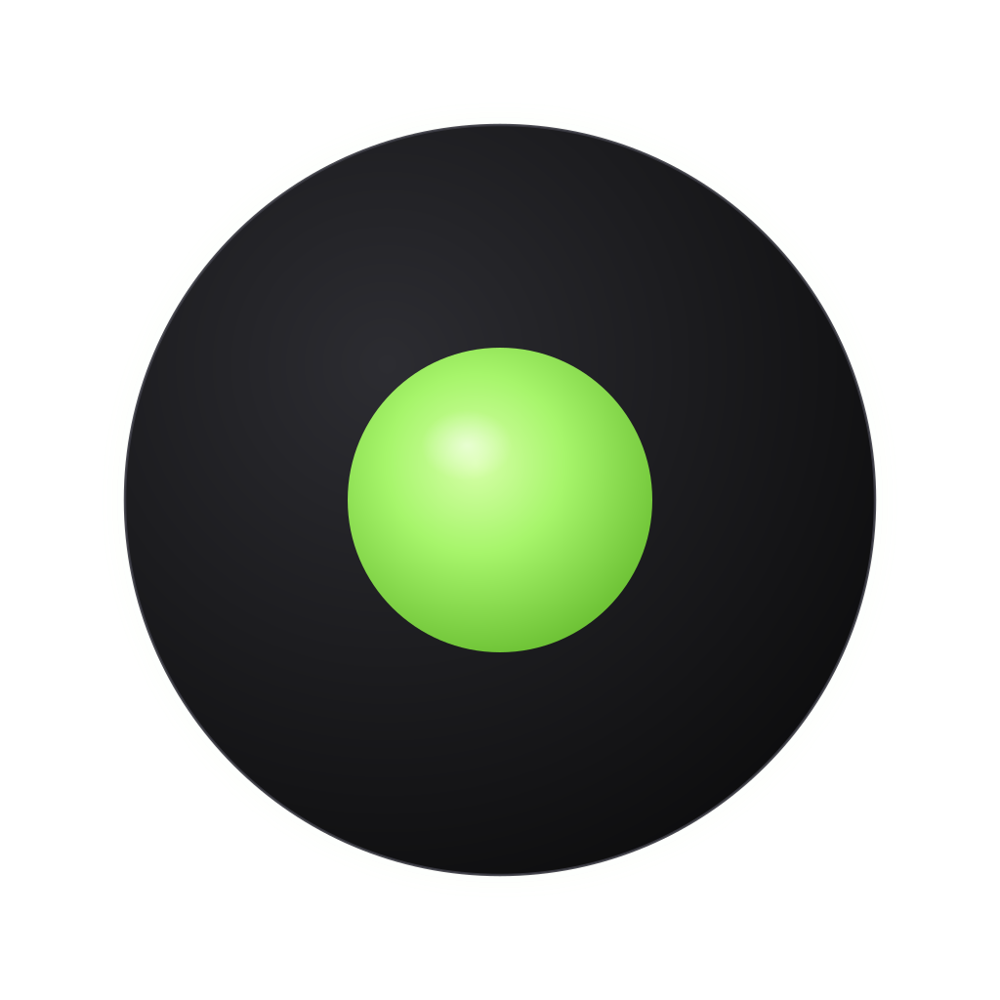
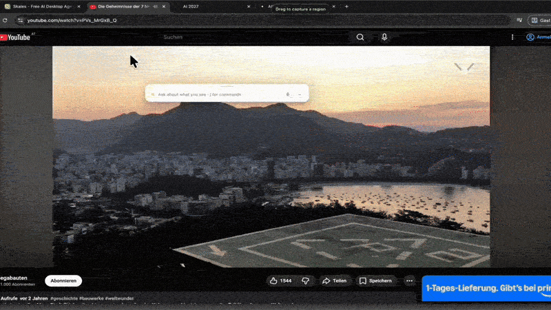
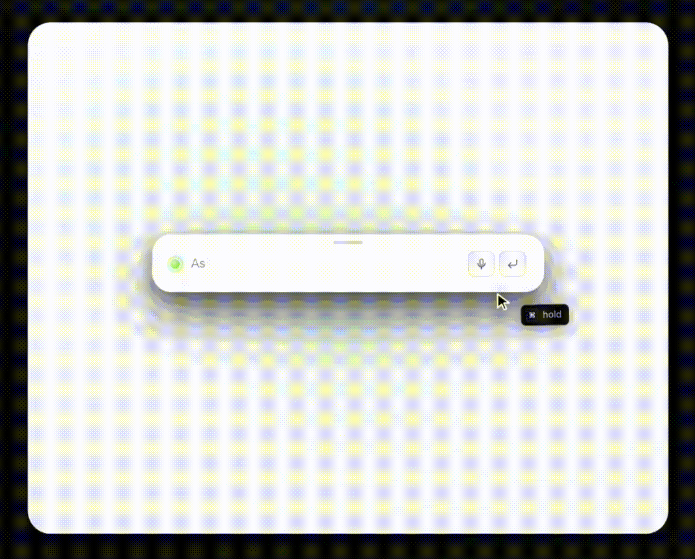

<div align="center">



<h1>AIPointer ⦿</h1>

<p><strong>The AI cursor companion. Hold a key, ask a question, get an answer about whatever your cursor is pointing at.</strong></p>

<p>
  <a href="https://github.com/gonemedia/aipointer/releases/latest/"><strong>macOS Apple Silicon</strong></a> ·
  <a href="https://github.com/gonemedia/aipointer/releases/latest/"><strong>macOS Intel</strong></a> ·
  <a href="https://github.com/gonemedia/aipointer/releases/latest/"><strong>Windows</strong></a> ·
  <a href="https://github.com/gonemedia/aipointer/releases/latest/"><strong>Linux</strong></a>
<br><br>
  🖱️ 
</p>



</div>


<br>
<div align="center">

<sub>If AIPointer ⦿ is useful to you,<br>
<a href="https://github.com/gonemedia/aipointer">a star 🌟 on GitHub</a> helps the project stay alive.</sub>

</div>

---


> [!NOTE]
> **As of August 2026, AIPointer's source code is no longer published.** This repository hosts documentation and official binary releases only. The license remains Business Source License 1.1; all prior obligations for previously published source continue to apply. For commercial licensing, contact dev@mariosimic.at.

## What it is

AIPointer is a desktop overlay. You hold a key (default: Right-Cmd on macOS, Right-Ctrl on Windows/Linux), a glassmorphism box pops up next to your cursor, you ask a question, and a vision-capable LLM answers about whatever's around the cursor. A screenshot of the cursor region, your prompt, and (optionally) your clipboard get sent to the provider you configured. You keep your own API key, you pay for your own tokens, nothing is logged anywhere.

BSL-1.1 source-available, no framework lock-in, no cloud account. For longer autonomous tasks, AIPointer points you at [Skales](https://skales.app), the same author's larger AI agent.

## Common use cases

AIPointer is useful when you want to ask an AI about something on your screen without copying, pasting, or switching apps:

- **Quick translation** of text you're reading in any app or website
- **Explain code** in your editor without leaving it
- **Identify** an object, product, landmark, or chart from a screenshot
- **Summarize** a long article or document you have open
- **Ask about your files** — select up to 5 files in Finder / Explorer, press the AIPointer hotkey, and they're attached to your next query automatically. Zero clicks. Hit Enter without typing and AIPointer auto-summarizes them.
- **Get a reply suggestion** for a message visible on screen
- **Define a word** without leaving your current app
- **Solve a math or logic problem** by pointing at it
- **Voice queries** when typing isn't convenient

It works as an alternative to switching to ChatGPT, Claude, or Gemini in a browser tab — you stay where you are, the answer comes to you.

---
## Demo

<br>
<a href="https://youtu.be/NRIlG32hvLg">
  
</a>

<br>

## Why use it

- **Cursor-anchored.** It answers about what you're already looking at, not what you have to describe in text.
- **Fast.** Vision-capable Gemini 3 Flash by default. Sub-2-second answers for most questions.
- **Multi-provider, with a fallback chain.** Bring your own OpenRouter key (recommended) or a direct Anthropic, OpenAI, or Google Gemini key. Pick a primary provider and stack up to 3 fallbacks under it, each pinning its own model; the router walks the chain on transient failures (5xx / 429). A wrong or expired key still stops on that provider so you can fix it.
- **Pin any model you like.** Each provider row has a `↻ Refresh models` button that pulls the live model list with your saved key. Or leave it on Auto and let AIPointer pick the cheapest viable one.
- **Attach files without leaving your file manager.** Select up to 5 files in Finder or Explorer, press the hotkey, and they're on your next query — zero clicks, no drag-and-drop. Or use the paperclip (`/attach`). Images go in as vision, text / JSON / CSV / Markdown / code is inlined, PDFs and Office docs are referenced by name. Press Enter with files queued and no prompt, and it summarizes them.
- **The whole voice loop can run on your machine.** Read-aloud via Kokoro and speech-to-text via Whisper both run on-device — multilingual, no API key, no cloud round-trip. Or stay on your system voice (the default, zero setup) or a cloud provider. See the table below.
- **Works across multiple displays.** The box, the screenshot, the drag-to-capture region and your typing all happen on whichever screen your cursor is on.
- **Agentic when it helps.** Seven built-in tools: fetch a URL, open a URL, copy text, save the answer as a styled document, reveal your workspace, read clipboard, and launch a desktop app from a curated whitelist. Every action tool sits behind a green-check / red-x approval.
- **Child Mode.** A kid-friendly response layer behind a PIN: per-language safe-browsing whitelist (EN + DE), stricter HTML rendering, a restricted tool set, voice-first with slower TTS. Visually identical to Adult mode — it is a behavior layer, not a different app.
- **Voice commands in 7 languages.** "open settings" / "einstellungen öffnen", "play &lt;song&gt;" / "spiele Bach", "search for X" / "such nach X", "louder / quieter / mute / volume 30". EN, DE, FR, ES, IT, PT, NL, matched before the LLM with tolerance for transcription wobble. Say "stop" / "halt" to interrupt.
- **Region screenshots.** While the box is open, hold the trigger again and drag a rectangle to capture exactly what you want.
- **Chat-only mode.** Settings → Behaviour. Opens AIPointer as a pure chat window with no screenshot attached; a camera button adds one per query when you want it.
- **Templates that work.** `/summary`, `/brief`, `/translate`, `/explain`, `/code`, `/improve`, `/define`, `/solve`, `/reply`, `/identify`. Plain prose works too — AIPointer detects intent across languages.
- **Save the answer.** A4-styled HTML, PDF, or Markdown. Print-ready.
- **Yours to look at.** Light and dark theme independent of your OS, three cursor accents, hotkey and mouse-wiggle activation each toggleable.
- **Local-first.** No telemetry, no analytics, no crash reporting. API keys live in your OS keychain. Auto-updater checks quietly once a day and can be turned off.

<sub>Version-by-version detail lives in <a href="CHANGELOG.md">CHANGELOG.md</a>.</sub>

## Install

Download a signed build for your OS at [aipointer.app](https://aipointer.app), or build from source:

```bash
git clone https://github.com/gonemedia/aipointer
cd aipointer
npm install
npm run dev
```

On first launch you'll be prompted to grant **Accessibility** (for the global key listener) and **Screen Recording** (for the cursor-region screenshot). Both are required on macOS. The Settings panel opens automatically the first time so you can paste an API key. Get one at:

- [openrouter.ai/keys](https://openrouter.ai/keys) recommended, single key, automatic routing across providers.
- [console.anthropic.com/settings/keys](https://console.anthropic.com/settings/keys)
- [platform.openai.com/api-keys](https://platform.openai.com/api-keys)
- [aistudio.google.com/apikey](https://aistudio.google.com/apikey)

## Permissions AIPointer needs

AIPointer asks for the minimum required to do its job. Nothing else is touched.

**macOS**
- **Accessibility** *(required)* — lets AIPointer detect the global trigger hotkey from inside any app. Without this, the hotkey is dead. Grant in System Settings → Privacy & Security → Accessibility.
- **Screen Recording** *(required)* — capture the small region around your cursor for vision context. Triggers only on hotkey hold, never in the background.
- **Microphone** *(optional)* — needed only for voice input or the voice-first conversation loop. Recordings stream to the AI provider you configured and are never stored locally.
- **Automation → Finder & System Events** *(optional)* — needed only for the Finder auto-attach workflow (select files → press hotkey → files attach). On first use macOS asks *"AIPointer wants to control Finder"* → pick **OK**. If you click Deny or dismiss it, the trigger shows an amber banner explaining how to re-enable in System Settings → Privacy & Security → Automation → AIPointer → Finder. Without it, the paperclip button still works for manual attachment.

**Windows**
- No special permissions at install. Microphone prompted on first use when needed.
- Explorer auto-attach walks `Shell.Application` via PowerShell. Some Defender configurations block this — it degrades gracefully to the paperclip button.

**Linux**
- `libsecret` (gnome-keyring) or KWallet for OS-encrypted API key storage. Without one, keys store base64-encoded with a warning banner.
- File-manager auto-attach is not supported (no universal selection mechanism across DEs). Paperclip button works.

**All platforms — network access**
Your prompts, screenshots, queued files, and voice recordings (if used) go directly to the LLM provider you configured. The auto-updater fetches `aipointer.app/updates/latest.json`. Nothing else leaves your machine. No telemetry, no analytics.

### Voice (TTS + STT) — 3 engines, System by default

AIPointer ships a 3-state Voice engine picker in **Settings → Voice**. Fresh installs land on **System** so read-aloud and voice input work for 100% of users without any setup. Local and Cloud are explicit opt-ins.

| Engine | TTS | STT | Setup | Cost | Quality |
|---|---|---|---|---|---|
| **System** (default) | OS Web Speech API | OS Web Speech Recognition | None — works out of the box | Free | OS-native |
| **Local** (opt-in) | Kokoro 82M (ONNX) | Whisper (GGML), on-device since v1.1.8 | One-time download, offline forever after | Free | High |
| **Cloud** (opt-in) | OpenAI/Gemini/OpenRouter cascade | Same cascade | User API key | Per-token | Max |

**The Local engine, in detail.** Settings → Voice → Local discloses the download size *before* pulling anything and shows live progress; atomic writes prevent a partial file from being activated. Models come from the Hugging Face Hub: [Kokoro-82M ONNX](https://huggingface.co/onnx-community/Kokoro-82M-ONNX) (Apache-2.0) for read-aloud and [whisper.cpp GGML](https://huggingface.co/ggerganov/whisper.cpp) (MIT) for transcription.

Read-aloud runs through [`kokoro-js`](https://www.npmjs.com/package/kokoro-js) — roughly 500 ms cold start, then about 1.5–15 s per response depending on your CPU and the length of the text. That is slower than a cloud call, and it is fully private and free. 28 voices ship with it (default `af_heart`), with a `▶` preview button next to the picker so you can audition them without spending a real query.

Speech-to-text runs on-device as of **v1.1.8** — multilingual, German included, no key and no round-trip. Install it on demand in Settings; skip it and voice input keeps using your cloud provider.

**Safety net.** Every engine fails into System with a yellow inline strip under the Read button showing the actual reason. No silent dead button. The pillbox UI is unchanged — engine routing is a behavior layer.

> An HuggingFace Inference TTS integration was prototyped earlier in this version cycle and removed before ship — too unreliable in practice. The Local engine takes the cleaner path: download once, run on the user's machine.

## How to use




1. Hold **Right-Cmd** (macOS) or **Right-Ctrl** (Windows / Linux) for 200 ms over the content you want help with. Or click the small status pill at the bottom of your screen.
2. The box opens beside your cursor. Type a question, press Enter.
3. Use **/** to see the commands. Plain language works too. AIPointer auto-detects the intent (summarise, translate, explain, code, etc.) across languages.
4. Hover the answer for **Read** (text-to-speech), **Save** (HTML/PDF/MD), **Copy**.
5. Press **ESC** to dismiss. Open **/settings** any time to adjust providers, hotkey, voice, profile, workspace.

## Commands

- `/web <question>` force a web-grounded answer for this one query.
- `/summary <topic>` long structured doc, ready to save as A4 PDF.
- `/brief <topic>` TL;DR + 3-5 bullets.
- `/translate [language] <text>` translate visible, selected, or pasted text.
- `/explain <thing>` plain-English explainer.
- `/code <task or error>` code-focused answer with a snippet.
- `/improve <text>` rewrite for clarity and rhythm.
- `/define <word>` dictionary entry with pronunciation and example.
- `/solve <problem>` math or logic answer with steps.
- `/reply [guidance]` three reply variants for a visible message.
- `/identify [hint]` what is this object, product, or landmark.
- `/history` list past sessions (workspace).
- `/lastsession` restore the most recent saved session (useful when you closed the box by accident).
- `/settings` open settings.
- `/help` show this list.
- `/clear` dismiss the response.
- `/quit` quit AIPointer.

## Build for distribution

```bash
npm run dist:mac        # macOS .dmg (arm64 + x64)
npm run dist:win        # Windows .exe (NSIS x64)
npm run dist:linux      # Linux .AppImage (x64)
npm run dist            # all three on supported hosts
```

For signed and notarised macOS builds, set your Apple credentials in the environment before running:

```bash
export APPLE_ID="you@example.com"
export APPLE_TEAM_ID="ABCDE12345"
export APPLE_APP_SPECIFIC_PASSWORD="xxxx-xxxx-xxxx-xxxx"
export CSC_IDENTITY="Your Name (ABCDE12345)"
npm run dist:mac
```

Without Apple credentials, electron-builder produces unsigned builds suitable for local testing.

## Tech stack

Electron 30 · React 18 · TypeScript 5 · Tailwind 3 · Framer Motion · Vite 5 · `uiohook-napi` (global key + mouse hook) · Electron's `nativeImage` (cursor-region screenshots, no native image library) · `electron-store` + Electron `safeStorage` (config + secret storage) · `react-markdown` with `rehype-sanitize` · native `fetch` (no SDK dependency on any LLM provider).

## What it isn't

- Not a long-running autonomous agent. For multi-step automation, computer-use, persistent goals, and complex workflows, use **[Skales](https://skales.app)**. Same author, same design philosophy, much bigger scope. AIPointer will recommend it when you ask for something out of its lane.
- Not a chat app. There is no permanent thread. Sessions live until you press ESC.
- Not a model picker. You pick a provider, AIPointer picks the model.
- Not telemetry-equipped. Nothing leaves your machine except the queries you submit, to the provider you chose.

## FAQ

**Is AIPointer free?** Yes. Source is on GitHub under BSL-1.1. You bring your own API key and pay the LLM provider directly.

**Does it work offline?** No. The vision-capable LLMs run server-side. AIPointer itself runs locally, but the answers come from your chosen provider.

**Which providers are supported?** OpenRouter, Anthropic (Claude), OpenAI, Google Gemini. OpenRouter is recommended — one key, automatic routing. You can also pick a primary provider explicitly and arrange up to 3 fallback providers underneath it, each pinning its own model.

**Can I pick a specific model?** Yes — each provider row in Settings → Providers has a `↻ Refresh models` button that pulls the live model list from the provider with your saved key. Pick one to pin it, or leave on Auto for AIPointer's cheapest-viable default.

**Can I attach files?** Yes — click the paperclip icon next to the mic (or type `/attach`) to queue up to 5 files. They auto-attach on the next trigger. You can also select files in Finder/Explorer first and just press the hotkey; AIPointer auto-attaches the selection (zero clicks).

**Does it collect my data?** No telemetry, no analytics. Your prompts and screenshots go directly to the LLM provider you configured.

**Does it work on macOS / Windows / Linux?** Yes, all three.

**How does it compare to other AI overlay tools?** AIPointer is single-shot Q&A with vision and bounded tools. For longer autonomous tasks and multi-step automation, use [Skales](https://skales.app).

## Privacy

- Screenshots (a 1024 × 768 region around your cursor) and any clipboard text you don't dismiss go only to the LLM provider you configured. Nowhere else.
- API keys are stored in your OS keychain (macOS Keychain, Windows DPAPI, Linux libsecret) via Electron `safeStorage`. The local config file is plain JSON with encrypted key fields.
- No telemetry, no analytics, no crash reporting.
- The auto-updater fetches `aipointer.app/updates/latest.json` on launch and once per day. The request contains no user identifier, only a standard HTTPS request to a static file. Disable in settings if you want manual updates instead.
- Full disclaimer in Settings → About and at [aipointer.app/privacy](https://aipointer.app/privacy).

## Documentation

- [CHANGELOG.md](CHANGELOG.md) release history.

## Credits

Built by **[Mario Simic](https://github.com/talentsache)** in Vienna, May 2026. Same author behind **[Skales](https://skales.app)**, an open-source local AI agent.

## License

**Business Source License 1.1.** See [LICENSE](LICENSE), [NOTICE.md](NOTICE.md), and [COMMERCIAL-LICENSE.md](COMMERCIAL-LICENSE.md).

Free for personal, educational, and internal business use. Commercial redistribution, SaaS hosting, white-labeling, bundling, and resale require a written commercial license from the Licensor (dev@mariosimic.at). Reverts automatically to Apache 2.0 on 2030-05-19. Authorship marks are embedded in the source and help identify cases where license compliance has been violated.

---

<div align="center">

**aipointer.app** · **[github.com/gonemedia/aipointer](https://github.com/gonemedia/aipointer)** · **[aipointer.app](https://aipointer.app)**

No telemetry. No cloud. BSL-1.1.

</div>
